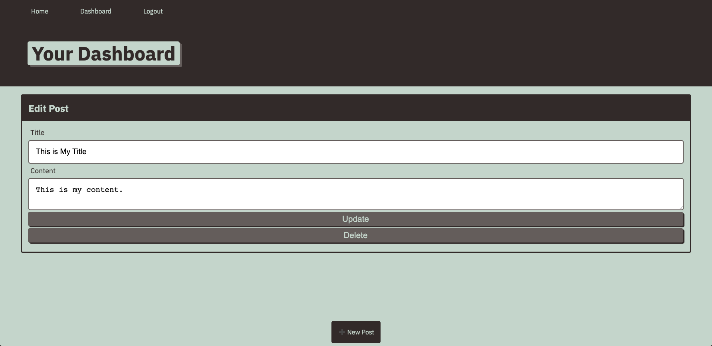

# Tech Blog

## Description

This application is a CMS style blog where developers can publish posts and comment on other developers' posts. This application follows the MVC paradign in architectural structure, uses Handlebars.js as the templating language, Sequelize as the ORM, and the express-session npm package for authentication.

## Deployed Application

Below is a link to the deployed application followed by a screenshot of the app's dashboard.

[Tech Blog](https://lit-brook-65474.herokuapp.com/)  

